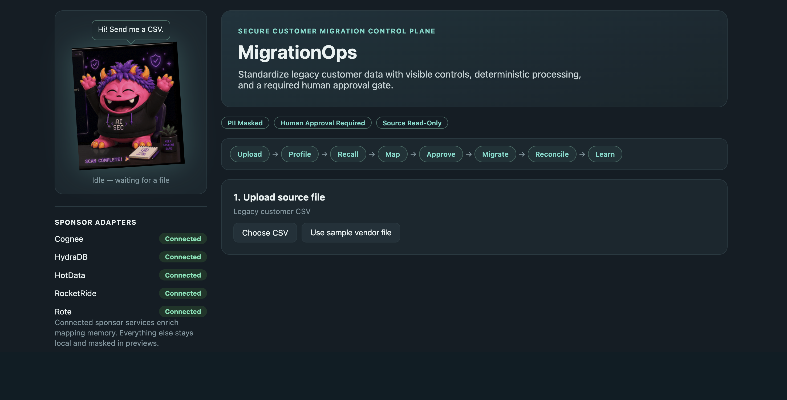
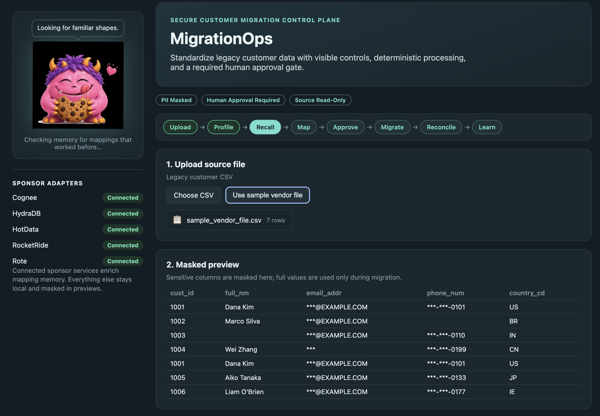
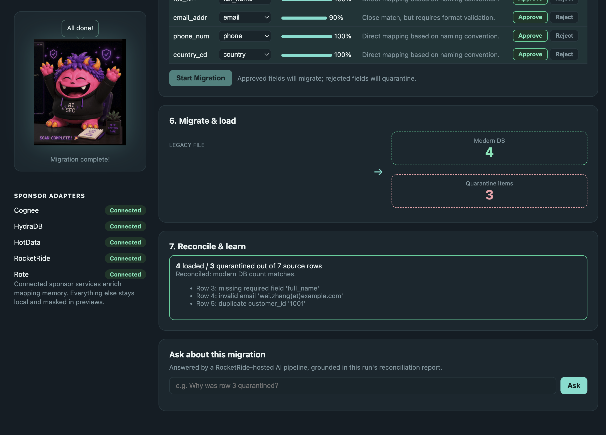
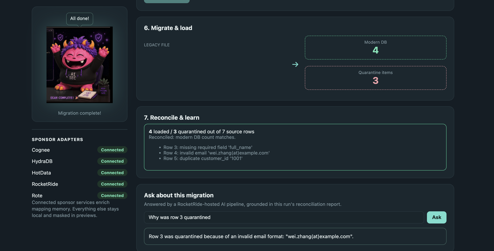
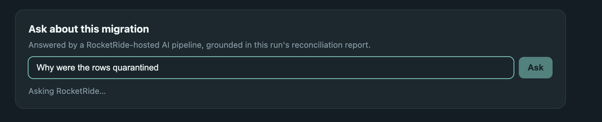
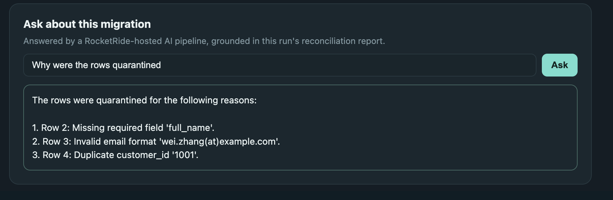
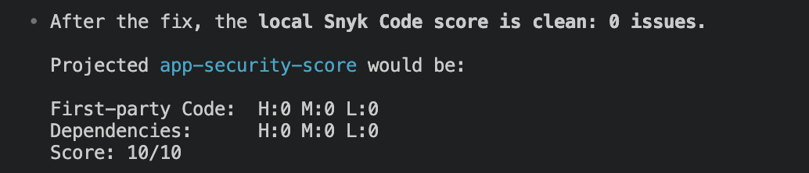

# ProtageOps

Secure, self-improving migration control plane for onboarding messy vendor data. A vendor
sends a CSV with columns like `cust_id`, `full_nm`, `email_addr` — ProtageOps profiles it,
flags sensitive or invalid data, recalls how a similarly-shaped file was mapped before,
drafts a field mapping with an LLM, requires a human to explicitly **Approve or Reject
every field**, migrates the approved data while quarantining the rest, reconciles the
counts, and remembers the outcome so the next file from that vendor maps itself faster.

A monster mascot on the frontend "eats" each record live as it's processed, sorting it
into the modern DB or the quarantine bin. Once a run finishes, you can ask it plain-language
questions about that migration ("why was row 3 quarantined?") and the answer comes back
from a real AI pipeline hosted on RocketRide's infrastructure, not a local call.

## Screenshots

**1. Upload → sponsor tools go live before a row is read.** Every run walks
the same eight visible stages — `Upload → Profile → Recall → Map → Approve →
Migrate → Reconcile → Learn` — and the three badges above it (`PII Masked`,
`Human Approval Required`, `Source Read-Only`) are the security contract, not
decoration: the source file is never mutated, sensitive columns are never
shown raw, and nothing loads without a person clicking Approve. The **Sponsor
Adapters** panel on the left is a live health check on **Cognee, HydraDB,
HotData, RocketRide, and Modiqo Rote** — all shown `Connected` before a file
is even chosen. (Snyk runs as a separate CLI/security-scan endpoint and
OpenAI's key is used silently during Map, so neither gets a tile here.)



**2. Recall → three sponsor tools query memory at once.** Once a file loads,
this is the exact moment `backend/main.py`'s `/recall` step fires off
**HydraDB** (`find_similar` — semantic search over past runs), **Cognee**
(`recall_context` — the mapping-memory adapter, shown here as "Looking for
familiar shapes"), and **Modiqo Rote** (`find_play` — checks for a
previously-crystallized play) in the same call, so whichever remembers this
vendor's shape first seeds the mapping suggestion. Underneath, the **masked
preview** redacts emails and phone numbers on screen — full values are only
used internally once Migrate actually runs — so a human can sanity-check row
shapes without seeing raw customer PII.



**3. Map → OpenAI drafts it, a human decides.** `llm_adapter.suggest_mappings`
(**OpenAI**, via `LLM_API_KEY`) proposes a target field, a confidence score,
and a plain-language reason for every source column — `email_addr → email`
at 90% because it's "a close match, but requires format validation,"
`phone_num → phone` at 100% on naming convention alone. Nothing migrates from
this screen: each row needs an explicit **Approve** or **Reject**, which is
the human-approval-gate promise from the top of this README actually
rendered as a button, not a config flag.



**4. Migrate & Reconcile → the write-back, then RocketRide answers for it.**
After approval, rows split deterministically into the modern DB or a
quarantine bin (`4 loaded / 3 quarantined out of 7 source rows`, with a
specific reason attached to every quarantined row), and behind the scenes
**Cognee** (`remember_mapping`), **HydraDB** (`save_migration`), and
**Modiqo Rote** (`capture_play`) all persist this run so the next file from
the same vendor maps itself faster — the "Learn" stage happening live. The
"Ask about this migration" box is answered by **RocketRide**: a real
pipeline (`chat → llm_openai → response`) running on RocketRide's own
infrastructure, grounded in this run's reconciliation report, not a local
LLM call — so "Why was row 3 quarantined?" gets an exact, sourced answer.



**5. Ask again → the round trip is real, not canned.** Typing a second
question ("Why were the rows quarantined") shows the box sitting in an
**"Asking RocketRide…"** state — an actual network call out to
`https://staging.rocketride.ai/` and back, not a pre-baked string swapped in
client-side. A moment later the same box resolves with a fresh,
freshly-worded answer that lists each quarantine reason again but in its own
phrasing, which is what a live model call grounded in the reconciliation
report looks like: the wording changes even though the underlying data
doesn't.

| In flight | Resolved |
|---|---|
|  |  |

**Not pictured in the flow: Snyk — run locally, and it caught a real bug.**
Snyk isn't wired into the web UI at all — by design, a dependency/code
security scan doesn't belong behind a demo button. It runs on demand from the
CLI (`snyk test` / `snyk code test`) or via `GET /api/security-scan`, which
calls `backend/adapters/snyk_adapter.py` directly. Scoring was done with
[`app-security-score`](https://github.com/javiergarza-snyk/app-security-score),
a Docker-based tool that wraps `snyk test --all-projects` (dependencies) and
`snyk code test` (static analysis) into one score. Running it against this
repo found **7 medium-severity DOM XSS findings in `frontend/app.js`**
(`javascript/DOMXSS`, lines 102, 106, 164, 180, 360, 393, 395): the masked
preview table, file chip, profile/recall panels, mapping table,
reconciliation report, and RocketRide answer/error output were all rendered
by writing directly into `innerHTML`. The fix switched every one of those to
safe DOM creation with `textContent` / `replaceChildren()` instead, and
`frontend/app.js` now has zero `innerHTML` / `outerHTML` /
`insertAdjacentHTML` calls anywhere. Verified with:

```
rg -n "innerHTML|insertAdjacentHTML|outerHTML" frontend/app.js   # no matches
node --check frontend/app.js
python -m py_compile backend/main.py backend/pipeline.py
snyk code test
```

That took the score from **7.9/10** (`First-party Code: H:0 M:7 L:0`) to a
clean **0 issues** locally — projected as **10/10** for first-party code once
pushed. Two caveats worth knowing: the dependency side of that score isn't
fully validated yet (`backend/requirements.txt` has an install/resolution
conflict blocking the dependency scan), and the GitHub-hosted
`app-security-score` scan for this repo will keep showing the old 7.9/10
until these local fixes are pushed. Full commands, raw scan output, and the
before/after breakdown are in [`SNYK_TESTING.md`](SNYK_TESTING.md).



## Demo Video

[Watch the demo video](https://drive.google.com/file/d/1vcnI7dyBww6r1zEI4ye3SYwGKgBUZ578/view?usp=sharing)

## Run it

```
conda run -n hack uvicorn backend.main:app --reload --app-dir . --port 8000
```

Then open http://localhost:8000

## Sponsor tool integration status

| Tool | Status | Notes |
|---|---|---|
| Cognee | **Live** | `backend/adapters/cognee_adapter.py` — stores/recalls mapping memory |
| OpenAI (LLM_API_KEY) | **Live** | `backend/adapters/llm_adapter.py` — generates field mapping suggestions |
| HotData | **Live** | `backend/adapters/hotdata_adapter.py` — real SQL profiling via the `hotdata-framework` SDK, run as one query over an inline `VALUES` table in a managed database |
| HydraDB | **Live** | `backend/adapters/hydra_adapter.py` — real ingest/semantic-search via the `hydra_db` SDK; mapping recall depends on HydraDB's own async indexing, so a just-saved mapping may take a little while to become recallable |
| Snyk | **Live** (CLI) | `backend/adapters/snyk_adapter.py` — run separately/locally (`snyk test`, or `GET /api/security-scan`); intentionally not exposed in the web UI. `snyk code test` caught a DOM XSS bug in `frontend/app.js`; see [Screenshots](#screenshots) for the fix and before/after score, and [`SNYK_TESTING.md`](SNYK_TESTING.md) for the full testing writeup |
| RocketRide | **Live** | `backend/adapters/rocketride_adapter.py` — key authenticates against `https://staging.rocketride.ai/`, a staging endpoint given directly by the sponsor (not in RocketRide's own docs, which only mention the default `https://cloud.rocketride.ai/` — that one rejects this key). Actually orchestrating: `/api/ask` ("Ask about this migration") builds a real RocketRide pipeline (`chat` source → `llm_openai` → `response`, per their documented `.pipe` schema), starts it with `client.use()`, and answers via `client.chat()` — the LLM call is made *by the RocketRide-hosted node*, not by us directly. This was the hardest integration to get working — see [`ROCKETRIDE_SETUP.md`](ROCKETRIDE_SETUP.md) for how the staging URL and auth key were actually found |
| Modiqo Rote | **Live** | `backend/adapters/modiqo_adapter.py` — "Modiqo Rote" is the `rote` CLI itself, already installed and authenticated on this machine (`rote whoami`). Its own play system is built for an agent to crystallize interactive sessions, not for a backend to call per-request, so mapping capture/replay stays app-owned state (`backend/data/plays.json`) while connection identity is genuinely delegated to Rote |

All 7 sponsor tools are now live. Each adapter still exposes the same function
signature regardless — that's what made swapping RocketRide/HydraDB/HotData/Modiqo
from local fallback to real integrations a same-file change, no callers touched.
