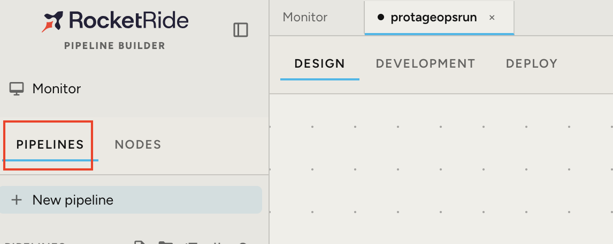
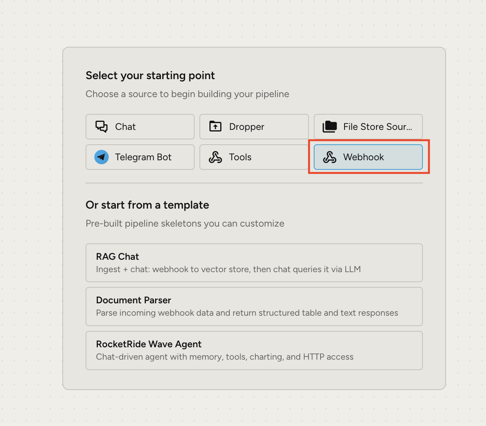
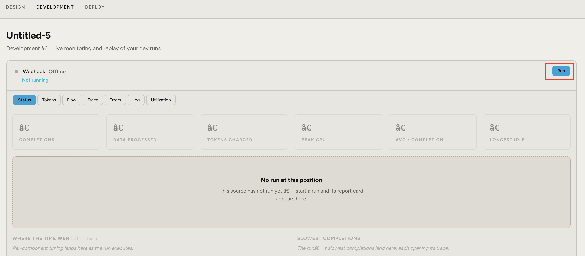
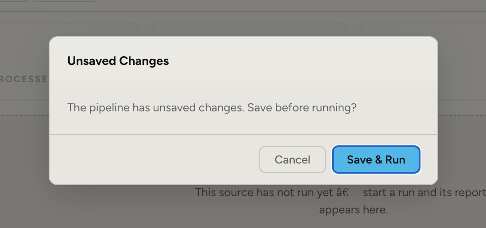
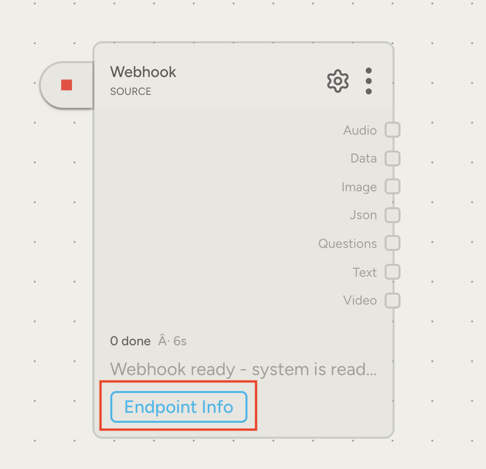
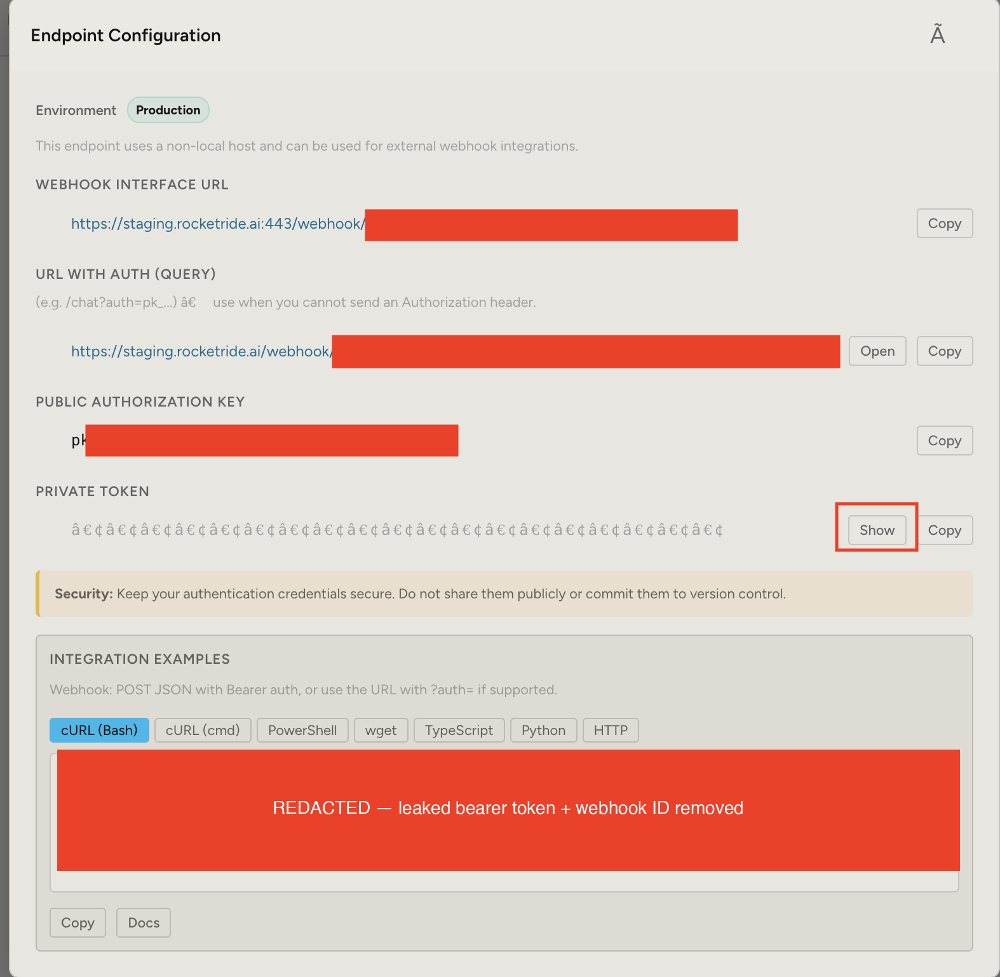
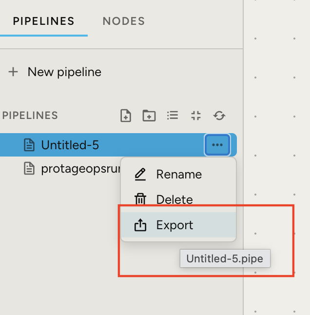
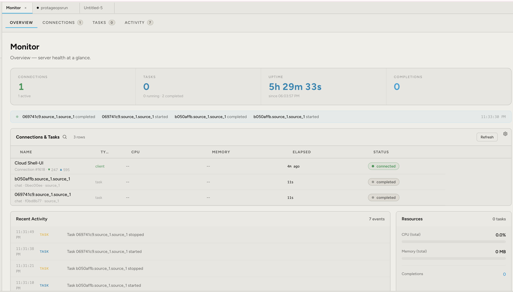

# RocketRide Integration Setup

Of the 7 sponsor tools in this project, **RocketRide was the hardest to wire
up** — its public docs only describe the default `https://cloud.rocketride.ai/`
endpoint, but the API key given for this hackathon only authenticates against
a staging endpoint (`https://staging.rocketride.ai/`) that isn't documented
anywhere. The only way to find the right URL and auth pattern was to build a
throwaway pipeline in RocketRide's own Pipeline Builder UI and read its
generated endpoint config. This doc walks through that process.

**Reading the screenshots below:** a solid red box hides a sensitive value
(URL path, key, or token) that was blacked out before these were committed —
a red outline highlights the button or tab to notice for that step.

## 1. Add a pipeline

In the Pipeline Builder, open **Pipelines → New pipeline**.

## 2. Add a Webhook setting

A new pipeline asks for a starting source. Pick **Webhook** — this is what
exposes a real HTTP endpoint (with its own URL and auth key) instead of a
purely internal trigger, which is what's needed to find out how RocketRide
expects external callers to authenticate.

## 3. Run it in dev

Switch to the **Development** tab and hit **Run**. RocketRide will prompt to
save unsaved pipeline changes before it'll actually start the run — confirm
with **Save & Run**.

## 4. Back in Design → grab the URL and token

Back on the **Design** tab, click **Endpoint Info** on the Webhook node.

This opens **Endpoint Configuration**, which is where the real integration
details live: the webhook interface URL, a URL-with-auth-query variant, a
public authorization key, and a private token — plus a ready-made `curl`
example showing exactly how to call it. This page is the answer to "what
host and auth scheme does RocketRide actually expect," which isn't written
down anywhere else.

## 5. Download the pipeline folder

From the pipeline list, use the **⋯ → Export** menu to download the pipeline
definition as a `.pipe` file.

## 6. Add it to the project folder

The exported file is checked into the repo root as
[`protageopsrun.pipe`](protageopsrun.pipe) — a record of the exact pipeline
shape RocketRide expects (a `chat` source feeding an `llm_openai` component
feeding a `response` output). The backend doesn't load this file at
request time; instead `backend/adapters/rocketride_adapter.py`'s
`_build_pipeline()` rebuilds the equivalent structure in Python and starts it
per-request via the `rocketride` SDK (`RocketRideClient.use(pipeline=...)`),
authenticating with the URL/key pattern discovered in step 4 through the
`ROCKETRIDE_URL` and `ROCKETRIDE_API_KEY` environment variables. Keeping the
exported `.pipe` around is what makes that Python pipeline dict verifiable
against a real, working pipeline instead of a guess.

The **Monitor** tab confirms the whole loop actually works end-to-end once
the app is running and calling it — connections and completed tasks showing
up live for the pipeline the backend calls:

## Result

`backend/adapters/rocketride_adapter.py` uses this exact URL/auth pattern in
production — see the [Sponsor tool integration status](README.md#sponsor-tool-integration-status)
table for how `/api/ask` ("Ask about this migration") uses it at runtime.
